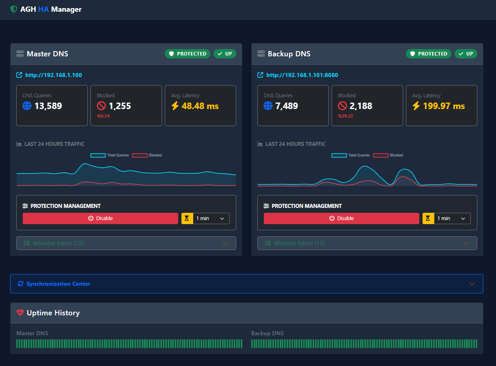

# 🛡️ AGH HA Manager

  

A professional, single-file PHP dashboard for managing **AdGuard Home** instances. Supports High Availability (HA) setups (Master/Backup) and also works in single-server mode.



---

## ✨ Features

### 🖥️ Dashboard
- **Modern UI:** Responsive, Dark Mode enabled Bootstrap 5 interface.
- **Visual Statistics:** Real-time graphs for DNS queries and blocked requests (Last 24h).
- **Health Monitoring:** Visual "Uptime Bar" showing historical status (UP/DOWN).
- **Live Status:** Instant view of protection status, latency, and query counts.
- **Whitelist Editor:** Domain-per-line editor that saves to AdGuard Home user rules.

### ⚡ Management & Sync
- **Optional Bi-Directional Sync (HA Mode):** 
  - Push Master ➜ Backup
  - Pull Backup ➜ Master
- **Protection Control:**
  - One-click Enable/Disable.
  - **Timed Pause:** Pause protection for 30s, 1m, 10m, 1h, etc.
  - Live countdown for paused servers.
- **CLI Support:** Fully scriptable for cron jobs and automation.

### 🧩 Single-Server Mode
- Disable the backup server via `backup_server: false`.
- The dashboard keeps working (stats, whitelist editor, protection controls, uptime history).
- Sync UI and second server panels are automatically hidden.

---

## 🚀 Installation

### 1. Requirements
- PHP 7.4 or higher
- `php-curl` extension
- Web Server (Apache, Nginx, Caddy) or Docker
- 1x or 2x AdGuard Home instances

### 2. Setup
Simply download the file (e.g., as `index.php`) and edit the configuration at the top:

```php
// index.php

$CONFIG = [
    'auth_enabled'  => true,      // Panel login
    'panel_user'    => 'admin',
    'panel_pass'    => 'admin123',

    'backup_server' => true,      // true: HA mode (master+backup), false: single-server mode
    'uptime_retention_hours' => 24, // 0 disables uptime storage & UI

    'servers' => [
        'master' => [
            'name' => 'Master DNS',
            'url'  => 'http://192.168.1.100',
            'auth' => true,
            'user' => 'adguard',
            'pass' => 'adguard1'
        ],
        'backup' => [
            'name' => 'Backup DNS',
            'url'  => 'http://192.168.1.101:8080',
            'auth' => true,
            'user' => 'adguard',
            'pass' => 'adguard1'
        ]
    ],

    'data_file' => __DIR__ . '/adguard_sync_data.json',
];
```

Security note: This file contains credentials; do not expose it publicly.

### 3. Authentication
- Enable login with `auth_enabled: true`. A modern login page consistent with the dashboard theme will be shown.
- Disable with `auth_enabled: false` to hide authentication and related UI (e.g., Logout).

### 4. Permissions
Ensure the script can write to its own directory (for `adguard_sync_data.json` storage).
The easiest way is to create the data file manually and give it write permissions:

```bash
touch adguard_sync_data.json
chmod 666 adguard_sync_data.json
```

*Note: `chmod 666` allows both the web server (www-data) and your CLI user to read/write the file, preventing permission errors.*

---

## 🤖 Automation (CLI & Cron)

You can use the script in CLI mode to automate synchronization and uptime checks.

**1. Check Uptime (Add to Cron every 5-10 mins):**
```bash
*/5 * * * * /usr/bin/php /var/www/html/index.php uptime
```

**2. Auto-Sync (Master to Backup):**
```bash
0 * * * * /usr/bin/php /var/www/html/index.php sync=master_to_backup
```

If `backup_server` is `false`, sync commands are ignored.

---

## 🛠️ Troubleshooting

- **Chart not showing?** Ensure AdGuard Home API is accessible and returning stats.
- **Permission Denied?** The script needs write permission to create `adguard_sync_data.json` for storing uptime history.
- **Login Loop?** Check if session cookies are working on your browser/server.

---

## 📜 License

MIT License. Free to use and modify.

---

## Author

BarışY — GitHub: [sinezty](https://github.com/sinezty)
